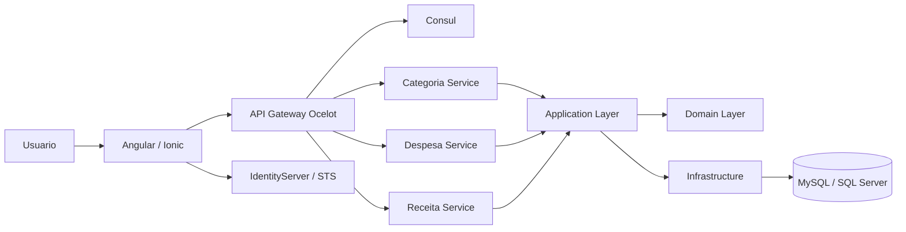

# 💸 Microservices Solution Design - Despesas Pessoais

> Solucao de controle financeiro pessoal baseada em microservicos, com backend em .NET, frontend Angular/Ionic, API Gateway Ocelot, descoberta de servicos com Consul, autenticacao via IdentityServer e persistencia relacional com Entity Framework Core.


## 📌 Sumario

- [🧭 Visao Geral](#-visao-geral)
- [🎯 Objetivos da Solucao](#-objetivos-da-solucao)
- [🧩 Capacidades Funcionais](#-capacidades-funcionais)
- [🏗️ Arquitetura](#️-arquitetura)
- [🔁 Fluxo de Requisicao](#-fluxo-de-requisicao)
- [🛰️ Servicos da Solucao](#️-servicos-da-solucao)
- [⚙️ Backend](#️-backend)
- [🖥️ Frontend](#️-frontend)
- [🔐 Autenticacao e Autorizacao](#-autenticacao-e-autorizacao)
- [🗄️ Persistencia e Banco de Dados](#️-persistencia-e-banco-de-dados)
- [🚪 API Gateway e Service Discovery](#-api-gateway-e-service-discovery)
- [🐳 Docker e Ambientes](#-docker-e-ambientes)
- [🚀 Execucao Local](#-execucao-local)
- [🧪 Testes e Qualidade](#-testes-e-qualidade)
- [📁 Estrutura de Pastas](#-estrutura-de-pastas)
- [⚠️ Pontos de Atencao Tecnicos](#️-pontos-de-atencao-tecnicos)
- [🛣️ Roadmap Tecnico Sugerido](#️-roadmap-tecnico-sugerido)
- [📄 Licenca](#-licenca)

## 🧭 Visao Geral

O **Microservices Solution Design - Despesas Pessoais** e uma plataforma para gerenciamento de financas pessoais. A aplicacao permite organizar receitas, despesas, categorias, lancamentos, saldo, perfil de usuario e indicadores financeiros por meio de uma interface web/mobile e APIs segregadas por dominio.

A solucao foi desenhada para demonstrar uma arquitetura distribuida com responsabilidades bem definidas:

- 🖥️ **Frontend Angular/Ionic** para experiencia do usuario, rotas protegidas, componentes reutilizaveis e clientes HTTP tipados.
- 🚪 **API Gateway Ocelot** como ponto unico de entrada para APIs internas.
- 🧭 **Consul** para registro e descoberta de microservicos.
- 🔐 **IdentityServer** como Security Token Service para emissao e validacao de tokens.
- ⚙️ **Microservicos .NET** para dominios de categoria, despesa e receita.
- 🧱 **Camadas compartilhadas** de dominio, aplicacao, infraestrutura, excecoes, CQRS, repositorios e Unit of Work.
- 🗄️ **Entity Framework Core** com suporte a MySQL/MariaDB e SQL Server.
- 🐳 **Docker Compose** para orquestracao de gateway, servicos, STS e Consul.

## 🎯 Objetivos da Solucao

- 🚪 Centralizar o acesso aos microservicos por meio de um API Gateway.
- 🧩 Separar dominios financeiros em servicos independentes e escalaveis.
- 🧠 Manter regras de negocio fora dos controllers, concentradas na camada de aplicacao.
- 📦 Utilizar DTOs e AutoMapper para separar contratos de API das entidades de dominio.
- 🔐 Proteger recursos por autenticacao JWT e politicas de autorizacao por perfil.
- 🗄️ Permitir evolucao de persistencia com estrategias por provedor de banco.
- 📱 Disponibilizar frontend responsivo com suporte a web, Android e iOS via Capacitor.
- 🧪 Apoiar qualidade por testes unitarios, mocks, coverage e organizacao modular.

## 🧩 Capacidades Funcionais

| Area | Funcionalidade | Implementacao principal |
| --- | --- | --- |
| 🔐 Autenticacao | Login, claims, tokens, scopes e refresh token | `src/IdentityServer`, `src/BackEnd/Services/AuthService` |
| 🏷️ Categorias | CRUD de categorias e filtro por tipo | `CategoriaService`, `ICategoriaBusiness` |
| 📉 Despesas | CRUD de despesas do usuario | `DespesaService`, `DespesaBusinessImpl` |
| 📈 Receitas | CRUD de receitas do usuario | `ReceitaService`, `ReceitaBusinessImpl` |
| 🔁 Lancamentos | Agregacao conceitual de movimentacoes financeiras | `Application`, `Domain`, `FrontEnd/pages/lancamentos` |
| 💰 Saldo | Calculo e apresentacao de saldo financeiro | `SaldoBusinessImpl`, `saldo.service.ts` |
| 📊 Dashboard | Indicadores e graficos financeiros | `GraficoBusinessImpl`, `bar-chart`, `dashboard.service.ts` |
| 👤 Perfil | Dados do usuario e imagem de perfil | `UsuarioBusinessImpl`, `ImagemPerfilUsuarioBusinessImpl` |
| 📱 Mobile | Empacotamento para Android/iOS | `src/FrontEnd/app-android`, `src/FrontEnd/app-ios` |

## 🏗️ Arquitetura

A solucao combina **microservicos**, **Clean Architecture em camadas**, **Repository Pattern**, **Unit of Work**, **DTOs**, **AutoMapper**, **CQRS** e **API Gateway Pattern**.

```text
Usuario
  -> Angular/Ionic SPA
  -> API Gateway Ocelot
  -> Consul Service Discovery
  -> Microservicos .NET
  -> Application Business Layer
  -> Domain Entities
  -> Infrastructure / Repository / Unit of Work
  -> Banco relacional
```

### 🧭 Visao Logica



### 🧱 Camadas Principais

| Camada | Caminho | Responsabilidade |
| --- | --- | --- |
| 🚪 Gateway | `src/api-gateway` | Entrada unica, roteamento Ocelot, autenticacao JWT e descoberta via Consul |
| 🔐 STS | `src/IdentityServer` | Emissao de tokens, recursos, scopes, clients, claims e Swagger do servico de identidade |
| 🛰️ Services | `src/BackEnd/Services` | Microservicos HTTP por dominio |
| ⚙️ Application | `src/BackEnd/Application` | Casos de uso, regras de aplicacao, DTOs, profiles AutoMapper e contratos de negocio |
| 🧬 Domain | `src/BackEnd/Domain` | Entidades, value objects e base de dominio |
| 🗄️ Infrastructure | `src/BackEnd/Infrastructure` | EF Core, DbContext, repositorios, Unit of Work, S3, estrategias de banco e mapeamentos |
| 🧰 CrossCutting | `src/BackEnd/CrossCutting` | CQRS, handlers e injecoes transversais |
| 🛡️ GlobalException | `src/BackEnd/GlobalException` | Excecoes customizadas e middleware de tratamento global |
| 🖥️ Frontend | `src/FrontEnd` | SPA Angular/Ionic, componentes, paginas, services, models e builds mobile |

## 🔁 Fluxo de Requisicao

1. O usuario acessa a aplicacao Angular.
2. O frontend autentica o usuario e armazena tokens conforme os services de autenticacao.
3. As chamadas HTTP sao enviadas para a URL base configurada em `src/FrontEnd/src/environments`.
4. O API Gateway recebe a requisicao e aplica middleware de token.
5. O Ocelot roteia a requisicao para o servico adequado usando configuracao local e descoberta via Consul.
6. O microservico resolve dependencias, valida usuario, chama a camada de aplicacao e aplica regras de negocio.
7. A camada de infraestrutura persiste ou consulta dados por EF Core, repositorios e Unit of Work.
8. O DTO de resposta retorna ao frontend pelo gateway.

## 🛰️ Servicos da Solucao

| Servico | Caminho | Porta interna | Rota base | Responsabilidade |
| --- | --- | ---: | --- | --- |
| 🚪 API Gateway | `src/api-gateway` | `9000` | `/api/*` | Roteamento, gateway e autenticacao |
| 🏷️ Categoria Service | `src/BackEnd/Services/CategoriaService` | configurada por ambiente | `/api/categoria` | CRUD e filtros de categorias |
| 📉 Despesa Service | `src/BackEnd/Services/DespesaService` | `9002` | `/api/despesa` | CRUD de despesas |
| 📈 Receita Service | `src/BackEnd/Services/ReceitaService` | `9003` | `/api/receita` | CRUD de receitas |
| 🔐 IdentityServer | `src/IdentityServer` | `8080/8081` no Compose | `/connect/*`, Swagger em dev | STS, tokens, clients e scopes |
| 🧭 Consul | imagem `consul:1.15.4` | `8500` | UI Consul | Service discovery |
| 🖥️ Frontend | `src/FrontEnd` | `4200/4201` em dev | `/` | Interface web e mobile |

## ⚙️ Backend

### 🧰 Tecnologias

| Tecnologia | Uso |
| --- | --- |
| 🟣 .NET `net10.0` | Target framework dos projetos backend |
| 🌐 ASP.NET Core | APIs HTTP dos microservicos e STS |
| 🗄️ Entity Framework Core | ORM, DbContext, migrations e persistencia |
| 🐬 Pomelo.EntityFrameworkCore.MySql | Provider MySQL/MariaDB |
| 🧱 Microsoft.EntityFrameworkCore.SqlServer | Provider SQL Server |
| 🔄 AutoMapper | Conversao entre entidades e DTOs |
| 📬 MediatR | Base para CQRS e handlers |
| 🧭 Consul | Registro e descoberta de servicos |
| 🚪 Ocelot | API Gateway |
| 🔐 IdentityServer4 | Servico de token e autorizacao |
| 🧪 xUnit, Bogus, Coverlet | Testes unitarios, massa fake e cobertura |
| ☁️ AWSSDK.S3 | Infraestrutura para armazenamento de arquivos/imagens |

### 🌐 Microservicos HTTP

#### 🏷️ Categoria Service

Controller: `src/BackEnd/Services/CategoriaService/Controllers/CategoriaController.cs`

| Metodo | Rota | Descricao | Autorizacao |
| --- | --- | --- | --- |
| `GET` | `/api/categoria` | Lista categorias do usuario | `User, Admin` |
| `GET` | `/api/categoria/GetById/{idCategoria}` | Busca categoria por ID | `User, Admin` |
| `GET` | `/api/categoria/GetByTipoCategoria/{tipoCategoria}` | Lista categorias por tipo | `User, Admin` |
| `POST` | `/api/categoria` | Cria categoria | `User, Admin` |
| `PUT` | `/api/categoria` | Atualiza categoria | `User, Admin` |
| `DELETE` | `/api/categoria/{idCategoria}` | Remove categoria | `User, Admin` |

#### 📉 Despesa Service

Controller: `src/BackEnd/Services/DespesaService/Controllers/DespesaController.cs`

| Metodo | Rota | Descricao |
| --- | --- | --- |
| `GET` | `/api/despesa` | Lista despesas do usuario |
| `GET` | `/api/despesa/GetById/{id}` | Busca despesa por ID |
| `POST` | `/api/despesa` | Cria despesa |
| `PUT` | `/api/despesa` | Atualiza despesa |
| `DELETE` | `/api/despesa/{idDespesa}` | Remove despesa |

#### 📈 Receita Service

Controller: `src/BackEnd/Services/ReceitaService/Controllers/ReceitaController.cs`

| Metodo | Rota | Descricao |
| --- | --- | --- |
| `GET` | `/api/receita` | Lista receitas do usuario |
| `GET` | `/api/receita/GetById/{id}` | Busca receita por ID |
| `POST` | `/api/receita` | Cria receita |
| `PUT` | `/api/receita` | Atualiza receita |
| `DELETE` | `/api/receita/{idReceita}` | Remove receita |

### ⚙️ Application Layer

A camada `Application` concentra contratos e implementacoes de negocio:

- 🔌 `Abstractions`: interfaces como `IBusinessBase`, `ICategoriaBusiness`, `IUsuarioBusiness`, `IAcessoBusiness`, `ISaldoBusiness` e `IGraficosBusiness`.
- 🧠 `Implementations`: regras de negocio para acesso, usuario, categoria, despesa, receita, lancamento, saldo, graficos e imagem de perfil.
- 📦 `Dtos`: contratos trafegados entre API, aplicacao e frontend.
- 🔄 `Dtos/Profile`: profiles AutoMapper para conversao entre entidades e DTOs.
- 🔐 `Authentication`: configuracoes e abstracoes relacionadas a token e assinatura.
- 🧩 `CommonDependenceInject`: extensoes de injecao de dependencia.

### 🧬 Domain Layer

A camada `Domain` representa o nucleo do modelo financeiro:

| Entidade / Value Object | Responsabilidade |
| --- | --- |
| 👤 `Usuario` | Usuario proprietario dos dados financeiros |
| 🔑 `Acesso` | Credenciais e informacoes de acesso |
| 🏷️ `Categoria` | Classificacao de receitas/despesas |
| 📉 `Despesa` | Saida financeira |
| 📈 `Receita` | Entrada financeira |
| 🔁 `Lancamento` | Movimentacao financeira consolidada |
| 🖼️ `ImagemPerfilUsuario` | Imagem associada ao usuario |
| 📊 `Grafico` | Modelo para indicadores financeiros |
| 🧾 `TipoCategoria` | Tipo de categoria |
| 🛡️ `PerfilUsuario` | Perfil e papeis do usuario |

### 🗄️ Infrastructure Layer

A infraestrutura encapsula detalhes de persistencia e integracoes:

- 🧱 `DatabaseContexts`: `RegisterContext`, `BaseContext` e estrategias por provedor.
- 📚 `Repository`: repositorios genericos e especificos.
- 🗺️ `Repository.Mapping`: mapeamentos EF Core das entidades.
- 🔁 `UnitOfWork`: coordenacao transacional.
- ☁️ `Amazon`: abstracao e implementacao para bucket S3.
- ✉️ `Email`: estrutura para integracoes de e-mail.
- 🧩 `CommonInjectDependence`: extensoes para registrar contexto, S3 e repositorios.

### 🧱 Padroes Aplicados

| Padrao | Onde aparece | Beneficio |
| --- | --- | --- |
| 🚪 API Gateway | `src/api-gateway` | Ponto unico de entrada e roteamento centralizado |
| 🧭 Service Discovery | `Consul`, `AddConsulSettings`, `UseConsul` | Registro dinamico dos servicos |
| 📚 Repository | `Infrastructure/Repository/Persistency` | Abstrai acesso a dados |
| 🔁 Unit of Work | `Infrastructure/Repository/UnitOfWork` | Coordena persistencia e transacoes |
| 📦 DTO | `Application/Dtos` | Evita expor entidades diretamente |
| 🔄 AutoMapper | `Application/Dtos/Profile` | Centraliza mapeamento entidade/DTO |
| ♟️ Strategy | `DatabaseContexts/Strategy` | Alterna comportamento por provedor de banco |
| 📨 CQRS | `CrossCutting/CQRS` | Separa comandos e consultas genericas |
| 🧱 Middleware | `GlobalException`, `TokenMiddleware` | Trata excecoes e tokens de forma transversal |

## 🖥️ Frontend

O frontend fica em `src/FrontEnd` e utiliza Angular 20 com suporte a Ionic/Capacitor.

### 🧰 Tecnologias

| Tecnologia | Uso |
| --- | --- |
| 🅰️ Angular 20 | SPA, rotas, componentes e services |
| 🧩 Angular Material / CDK | Componentes e infraestrutura visual |
| 🎨 Bootstrap / MDB UI Kit | Layout e elementos de interface |
| 📱 Ionic / Capacitor | Empacotamento mobile Android/iOS |
| 🔄 RxJS | Fluxos assincronos |
| 📊 Chart.js / ng2-charts | Graficos financeiros |
| 📋 DataTables | Tabelas e listagens |
| 🧪 Karma / Jasmine | Testes unitarios |
| 🌐 Nginx | Publicacao da SPA em container |

### 🧭 Rotas Principais

Arquivo: `src/FrontEnd/src/app/app.routing.module.ts`

| Rota | Protegida | Descricao |
| --- | --- | --- |
| 🔑 `/` | Nao | Login |
| 📝 `/register` | Nao | Cadastro/acesso |
| 📊 `/dashboard` | Sim | Painel financeiro |
| 🏷️ `/categoria` | Sim | Gestao de categorias |
| 📉 `/despesa` | Sim | Gestao de despesas |
| 📈 `/receita` | Sim | Gestao de receitas |
| 🔁 `/lancamento` | Sim | Lancamentos |
| 👤 `/perfil` | Sim | Perfil do usuario |
| ⚙️ `/configuracoes` | Sim | Configuracoes |
| 🛡️ `/privacy` | Nao | Privacidade |

### 📁 Organizacao

| Pasta | Responsabilidade |
| --- | --- |
| 📄 `src/app/pages` | Paginas de negocio e modulos lazy-loaded |
| 🧩 `src/app/components` | Componentes reutilizaveis como tabela, modal, alerta, graficos e toolbar |
| 🌐 `src/app/services/api` | Services HTTP por dominio |
| 🔐 `src/app/services/auth` | Autenticacao local e Google |
| 🎟️ `src/app/services/token` | Armazenamento de token |
| 📦 `src/app/models` | Interfaces TypeScript dos contratos |
| ⚙️ `src/environments` | URLs base e configuracoes por ambiente |
| 📱 `app-android`, `app-ios` | Projetos mobile via Capacitor |

### 🌎 URLs por Ambiente

| Arquivo | `BASE_URL` |
| --- | --- |
| `environment.ts` | `https://alexfariakof.com/api` |
| `environment.local.ts` | `https://localhost:42535/api` |
| `environment.dev.ts` | `https://alexfariakof.com:42535/api` |

## 🔐 Autenticacao e Autorizacao

O projeto possui um STS em `src/IdentityServer`, baseado em IdentityServer4, com:

- 🪪 recursos de identidade `openid`, `profile` e `email`;
- 🚪 API resource `api-gateway`;
- 🎯 scope `sts-scope`;
- 🧾 client `client-microservices`;
- 🔑 suporte a `ResourceOwnerPassword` e `ClientCredentials`;
- 🔄 refresh token com expiracao deslizante;
- 🧬 claims `openid`, `profile`, `email`, `userid` e `role`;
- 📚 Swagger habilitado em ambiente de desenvolvimento.

O API Gateway configura autenticacao JWT com:

```text
Authority: https://internal:7199
Audience: api-gateway
```

Os controllers podem aplicar autorizacao por roles. Em `CategoriaController`, por exemplo, as rotas usam:

```csharp
[Authorize("Bearer", Roles = "User, Admin")]
```

## 🗄️ Persistencia e Banco de Dados

A persistencia usa Entity Framework Core e suporta provedores diferentes por configuracao.

### ⚙️ Configuracao de Provedor

A extensao `ConfigureRegisterSqlContext` le a chave:

```json
{
  "DatabaseProvider": "MySql"
}
```

Provedores suportados na implementacao atual:

- 🐬 `MySql`
- 🧱 `SqlServer`

As connection strings esperadas sao:

- 🔌 `ConnectionStrings:MySqlConnectionString`
- 🔌 `ConnectionStrings:SqlConnectionString`

### 🐬 MariaDB para Desenvolvimento

O arquivo `src/BackEnd/Migrations.MySqlServer/docker-compose.yml` disponibiliza MariaDB:

| Configuracao | Valor |
| --- | --- |
| 🖼️ Imagem | `mariadb:10.3.39` |
| 🚪 Porta | `3306:3306` |
| 🗄️ Database | `DespesasPessoaisDB` |
| 👤 Usuario | `docker` |
| 🔑 Senha | `docker` |
| 🛡️ Root password | `!12345` |

Comando:

```bash
docker compose -f src/BackEnd/Migrations.MySqlServer/docker-compose.yml up -d
```

### 🧬 Migrations

Documentacao base: `src/BackEnd/Migrations.MySqlServer/migrations.md`

```bash
dotnet ef migrations add Initial -o Migrations.Application
dotnet ef database update
```

## 🚪 API Gateway e Service Discovery

O API Gateway fica em `src/api-gateway` e usa Ocelot com Consul.

### 🛣️ Rotas Ocelot

Arquivo: `src/api-gateway/ocelot.json`

| Upstream | Downstream | ServiceName | Metodos |
| --- | --- | --- | --- |
| `/api/categoria` | `/api/categoria` | `categoria-service` | `GET`, `POST`, `PUT`, `DELETE` |
| `/api/despesa` | `/api/despesa` | `despesa-service` | `GET`, `POST`, `PUT`, `DELETE` |
| `/api/receita` | `/api/receita` | `receita-service` | `GET`, `POST`, `PUT`, `DELETE` |

### 🧭 Consul

Configuracao global do Ocelot:

```json
{
  "ServiceDiscoveryProvider": {
    "Scheme": "http",
    "Host": "consul",
    "Port": 8500,
    "Type": "Consul",
    "PollingInterval": 100000
  }
}
```

UI local do Consul:

```text
http://localhost:8500
```

## 🐳 Docker e Ambientes

### 📦 Arquivos Compose da Raiz

| Arquivo | Uso |
| --- | --- |
| 🧱 `docker-compose.yml` | Compose base com gateway e microservicos principais |
| 🛠️ `docker-compose.override.yml` | Override de desenvolvimento com STS e Consul |
| 🧪 `docker-compose.dev.yml` | Variante de desenvolvimento |
| 🚪 `docker-compose.api-gateway.yml` | Execucao isolada do gateway |
| 🔐 `docker-compose.IdentityServer.yml` | Execucao isolada do IdentityServer |
| 🧭 `docker-compose.consul.yml` | Execucao isolada do Consul |

### 🧱 Containers Principais

| Container | Origem | Observacao |
| --- | --- | --- |
| 🚪 `api-gateway` | `src/api-gateway/Dockerfile` | Publicado em `4000:9000` no compose base |
| 🏷️ `categoria-service` | `src/BackEnd/Services/CategoriaService/Dockerfile` | Registrado como `categoria-service` |
| 📉 `despesa-service` | `src/BackEnd/Services/DespesaService/Dockerfile` | Registrado como `despesa-service` |
| 📈 `receita-service` | `src/BackEnd/Services/ReceitaService/Dockerfile` | Registrado como `receita-service` |
| 🔐 `app-sts` | `src/IdentityServer/Dockerfile` | Security Token Service |
| 🧭 `consul` | `consul:1.15.4` | Service discovery |

### 🚀 Subida Completa

```bash
docker compose up --build
```

Com override de desenvolvimento:

```bash
docker compose -f docker-compose.yml -f docker-compose.override.yml up --build
```

Parar e remover containers:

```bash
docker compose down
```

## 🚀 Execucao Local

### ✅ Pre-requisitos

- 🟣 .NET SDK compativel com `net10.0`
- 🟢 Node.js compativel com Angular 20
- 🐳 Docker e Docker Compose
- 🗄️ MariaDB/MySQL ou SQL Server
- 🔐 Certificados HTTPS locais quando executar frontend com SSL

### ⚙️ Backend

Restaurar e compilar a solution principal:

```bash
dotnet restore sln-api-gateway.sln
dotnet build sln-api-gateway.sln
```

Executar gateway:

```bash
dotnet run --project src/api-gateway/api-gateway.csproj
```

Executar servicos individualmente:

```bash
dotnet run --project src/BackEnd/Services/CategoriaService/CategoriaService.csproj
dotnet run --project src/BackEnd/Services/DespesaService/DespesaService.csproj
dotnet run --project src/BackEnd/Services/ReceitaService/ReceitaService.csproj
```

Executar STS:

```bash
dotnet run --project src/IdentityServer/sts-server.csproj
```

### 🖥️ Frontend

Instalar dependencias:

```bash
cd src/FrontEnd
npm install
```

Executar em desenvolvimento local:

```bash
npm start
```

Build:

```bash
npm run build
```

Build com configuracao local:

```bash
npm run build:local
```

Executar em container local:

```bash
cd src/FrontEnd
docker compose up --build
```

## 🧪 Testes e Qualidade

### ⚙️ Backend

Projeto de testes:

```text
src/BackEnd/XunitTests/XUnit.Tests.csproj
```

Executar testes:

```bash
dotnet test src/BackEnd/XunitTests/XUnit.Tests.csproj
```

Executar com cobertura via Coverlet:

```bash
dotnet test src/BackEnd/XunitTests/XUnit.Tests.csproj \
  /p:CollectCoverage=true \
  /p:CoverletOutputFormat=cobertura
```

O projeto usa:

- 🧪 xUnit;
- 🧬 Bogus para geracao de massa fake;
- 🧱 Moq.EntityFrameworkCore;
- 📊 Coverlet;
- 🛠️ Microsoft.NET.Test.Sdk.

### 🖥️ Frontend

Executar testes unitarios:

```bash
cd src/FrontEnd
npm test
```

Gerar cobertura:

```bash
npm run test:coverage
```

Scripts auxiliares:

```bash
./generate_coverage_report.sh
./generate_coverage_report.ps1
```

### 📈 Qualidade Continua

O README do frontend referencia SonarCloud e testes end-to-end em um projeto separado com Python/Playwright. Esses itens indicam uma preocupacao com qualidade, cobertura, confiabilidade e analise estatica, embora a execucao E2E nao esteja dentro deste repositorio.

## 📁 Estrutura de Pastas

```text
.
├── docker-compose.yml
├── docker-compose.override.yml
├── docker-compose.dev.yml
├── docker-compose.api-gateway.yml
├── docker-compose.IdentityServer.yml
├── docker-compose.consul.yml
├── sln-api-gateway.sln
├── src
│   ├── api-gateway
│   │   ├── Program.cs
│   │   ├── ocelot.json
│   │   ├── ocelot.development.json
│   │   └── Configuration
│   ├── IdentityServer
│   │   ├── Program.cs
│   │   ├── IdentityServerConfigurations.cs
│   │   ├── Quickstart
│   │   ├── Views
│   │   └── Data
│   ├── BackEnd
│   │   ├── Application
│   │   ├── Domain
│   │   ├── Infrastructure
│   │   ├── CrossCutting
│   │   ├── GlobalException
│   │   ├── Services
│   │   │   ├── AuthService
│   │   │   ├── CategoriaService
│   │   │   ├── DespesaService
│   │   │   └── ReceitaService
│   │   ├── Migrations.MySqlServer
│   │   ├── Migrations.DataSeeders
│   │   └── XunitTests
│   └── FrontEnd
│       ├── src/app
│       ├── app-android
│       ├── app-ios
│       ├── Dockerfile
│       ├── Dockerfile.local
│       └── nginx.conf
└── readme.md
```

## ⚙️ Variaveis e Configuracoes Importantes

| Chave | Uso |
| --- | --- |
| 🌎 `ASPNETCORE_ENVIRONMENT` | Ambiente de execucao dos servicos |
| 🌐 `ASPNETCORE_URLS` | URL/porta exposta pelo ASP.NET Core |
| 🚪 `ASPNETCORE_HTTP_PORTS` | Porta HTTP no container |
| 🔐 `ASPNETCORE_HTTPS_PORTS` | Porta HTTPS no container |
| 🧭 `CONSUL_HOST` | Host do Consul |
| 🛰️ `SERVICE_DISCOVERY_URL` | URL do service discovery |
| 🗄️ `DatabaseProvider` | Provider de banco: `MySql` ou `SqlServer` |
| 🔌 `ConnectionStrings:MySqlConnectionString` | Connection string MySQL/MariaDB |
| 🔌 `ConnectionStrings:SqlConnectionString` | Connection string SQL Server |
| 🔑 `CryptoConfigurations` | Opcoes de criptografia usadas pelo STS |

## ⚠️ Pontos de Atencao Tecnicos

- 📄 O arquivo `readme.md` da raiz estava vazio antes desta documentacao.
- 🧭 Alguns scripts e referencias de teste ainda mencionam nomes antigos como `Despesas.Backend`, `Despesas.Repository` e `AngularApp`. Isso indica legado de estrutura anterior e pode exigir ajuste antes de automatizar CI/CD.
- 🧪 O projeto de testes referencia `..\Repository\Repository.csproj`, mas a estrutura atual concentra repositorios em `src/BackEnd/Infrastructure/Repository`. Validar build dos testes apos a reorganizacao.
- 🔐 `CategoriaController` aplica `[Authorize]`, enquanto `DespesaController` e `ReceitaController` possuem atributos de autorizacao comentados. Padronizar isso e importante para seguranca.
- 🔑 O `IdentityServerConfigurations.cs` contem client secret e outros identificadores em codigo. Para producao, mover segredos para variaveis de ambiente, cofre de segredos ou user secrets.
- 🌐 A configuracao do gateway aponta `Authority` para `https://internal:7199`. Em Docker/local, validar DNS, certificados e porta real do STS.
- 🧹 Ha arquivos com espaco antes de `.cs`, como `OracleProviderStrategy .cs` e `SqlServerProviderStrategy .cs`; isso pode prejudicar manutencao e automacoes.
- 📄 O `licence` da raiz esta vazio. Definir uma licenca formal antes de distribuicao publica.

## 🛣️ Roadmap Tecnico Sugerido

1. 🔐 Padronizar autenticacao em todos os microservicos e controllers.
2. 🧪 Corrigir referencias legadas do projeto de testes e scripts de cobertura.
3. 🔑 Externalizar segredos do IdentityServer e connection strings.
4. ⚙️ Criar pipelines de CI com `dotnet restore`, `dotnet build`, `dotnet test`, `npm ci`, `npm test` e build Docker.
5. ❤️ Adicionar health checks por servico e expor readiness/liveness no Compose.
6. 📚 Versionar contratos OpenAPI dos microservicos e do gateway.
7. 📝 Criar documentacao especifica por servico em cada pasta de `Services`.
8. 🔄 Avaliar migracao do IdentityServer4, conforme estrategia de suporte e compatibilidade do ambiente.
9. 🧱 Consolidar nomes de namespaces e pastas apos a modernizacao para `.NET 10`.
10. 📈 Definir politica de logs, correlation ID e observabilidade distribuida.

## 📄 Licenca

O arquivo `licence` existe na raiz, mas esta vazio. Recomenda-se definir explicitamente a licenca do projeto antes de uso, distribuicao ou publicacao.
