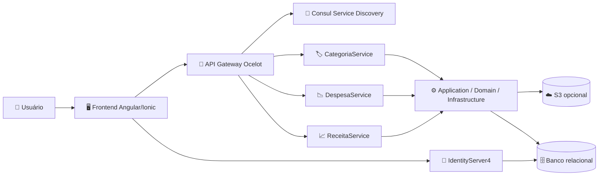
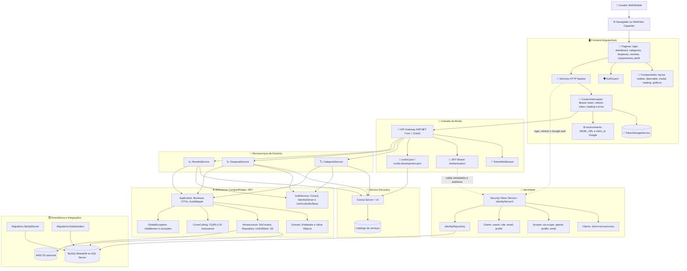
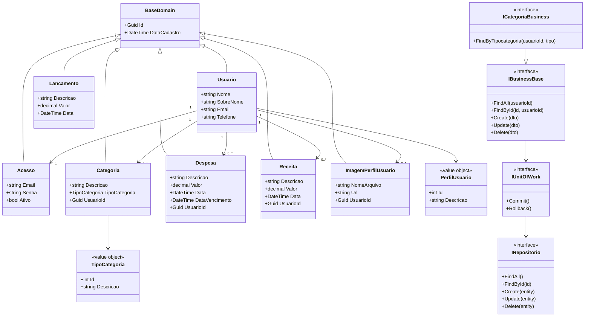
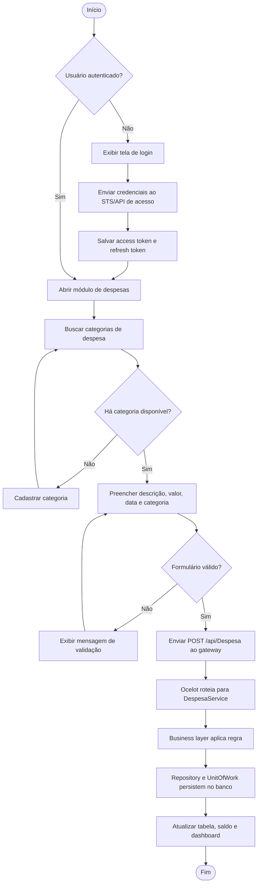
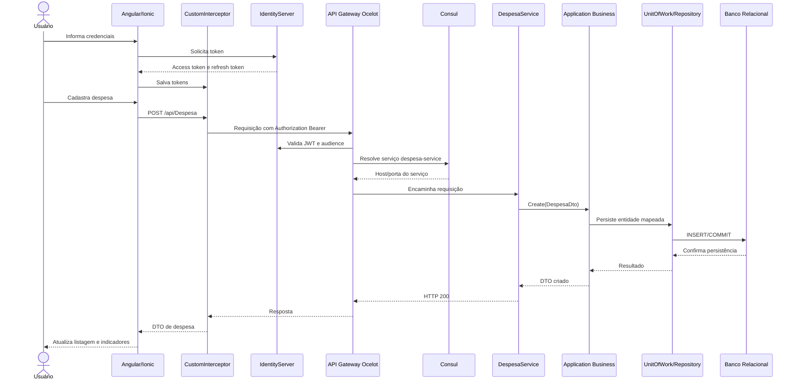

# 💸 Microservices Solution Design - Despesas Pessoais

> Solução de finanças pessoais baseada em **microserviços**, com frontend **Angular/Ionic**, backend **.NET**, API Gateway com **Ocelot**, descoberta de serviços com **Consul**, autenticação com **IdentityServer4** e persistência relacional via **Entity Framework Core**.

      

## 📌 Sumário

- [💸 Microservices Solution Design - Despesas Pessoais](#-microservices-solution-design---despesas-pessoais)
  - [📌 Sumário](#-sumário)
  - [🧭 Visão geral](#-visão-geral)
  - [🧠 Legenda técnica](#-legenda-técnica)
  - [🔎 Escopo documentado](#-escopo-documentado)
  - [🎯 Objetivos da solução](#-objetivos-da-solução)
  - [🧩 Capacidades funcionais](#-capacidades-funcionais)
  - [🛠️ Stack técnica](#️-stack-técnica)
  - [🏗️ Arquitetura da solução](#️-arquitetura-da-solução)
    - [Visão arquitetural detalhada](#visão-arquitetural-detalhada)
    - [Camadas arquiteturais](#camadas-arquiteturais)
    - [Fluxo lógico por requisição](#fluxo-lógico-por-requisição)
    - [Serviços em runtime](#serviços-em-runtime)
  - [📊 Diagramas](#-diagramas)
    - [Diagrama de Arquitetura - Visão Macro da Solução de Despesas Pessoais](#diagrama-de-arquitetura---visão-macro-da-solução-de-despesas-pessoais)
    - [Diagrama de Arquitetura - Topologia Detalhada dos Microserviços de Despesas Pessoais](#diagrama-de-arquitetura---topologia-detalhada-dos-microserviços-de-despesas-pessoais)
    - [Diagrama de Classe - Modelo de Domínio Financeiro e Contratos de Aplicação](#diagrama-de-classe---modelo-de-domínio-financeiro-e-contratos-de-aplicação)
    - [Diagrama de Atividade - Fluxo de Cadastro de Despesa com Categoria](#diagrama-de-atividade---fluxo-de-cadastro-de-despesa-com-categoria)
    - [Diagrama de Sequência - Autenticação, Gateway e Persistência de Despesa](#diagrama-de-sequência---autenticação-gateway-e-persistência-de-despesa)
  - [🚪 API Gateway e Service Discovery](#-api-gateway-e-service-discovery)
    - [Rotas Ocelot](#rotas-ocelot)
  - [🔐 Autenticação e autorização](#-autenticação-e-autorização)
  - [📡 Backend .NET](#-backend-net)
    - [Microserviços HTTP](#microserviços-http)
    - [Padrões aplicados](#padrões-aplicados)
  - [🖥️ Frontend Angular/Ionic](#️-frontend-angularionic)
    - [Rotas principais](#rotas-principais)
    - [Services e contratos HTTP](#services-e-contratos-http)
    - [Ambientes](#ambientes)
  - [🗄️ Persistência, migrations e seeders](#️-persistência-migrations-e-seeders)
  - [🐳 Docker e ambientes](#-docker-e-ambientes)
  - [🚀 Execução local](#-execução-local)
    - [Backend com Docker Compose](#backend-com-docker-compose)
    - [Frontend](#frontend)
    - [Testes backend](#testes-backend)
    - [Testes frontend](#testes-frontend)
  - [🧪 Testes e qualidade](#-testes-e-qualidade)
  - [📁 Estrutura de pastas](#-estrutura-de-pastas)
  - [⚠️ Pontos de atenção técnica](#️-pontos-de-atenção-técnica)
  - [🛣️ Roadmap técnico sugerido](#️-roadmap-técnico-sugerido)
  - [📄 Licença](#-licença)

## 🧭 Visão geral

O **Microservices Solution Design - Despesas Pessoais** é uma plataforma para organização financeira pessoal. A solução permite estruturar cadastros de usuários, categorias, despesas, receitas, lançamentos, saldo, dashboard e imagem de perfil por meio de uma interface Angular/Ionic e APIs .NET segmentadas por domínio.

A arquitetura foi organizada para demonstrar uma solução distribuída com responsabilidades bem definidas:

- 🖥️ **Frontend Angular/Ionic**: SPA responsiva, rotas protegidas, serviços HTTP tipados, interceptor de token, refresh token, componentes reutilizáveis e builds mobile com Capacitor.
- 🚪 **API Gateway Ocelot**: ponto único de entrada para rotas de microserviços, validação JWT, middleware de token, balanceamento e integração com Consul.
- 🧭 **Consul**: service discovery usado para registro e resolução de serviços internos.
- 🔐 **IdentityServer4**: Security Token Service responsável por clients, scopes, resources, claims e emissão de tokens.
- 📡 **Microserviços .NET**: serviços HTTP independentes para categoria, despesa e receita.
- 🧱 **Bibliotecas compartilhadas**: Application, Domain, Infrastructure, CrossCutting, GlobalException, AuthService, migrations e testes.
- 🗄️ **Persistência relacional**: Entity Framework Core com estratégias para MySQL/MariaDB, SQL Server e Oracle em pontos de infraestrutura.

## 🧠 Legenda técnica

| Ícone | Significado |
| --- | --- |
| 🧭 | Direção arquitetural, fluxo ou decisão técnica. |
| 🧩 | Domínio, contratos, DTOs e regras de negócio. |
| ⚙️ | Aplicação, services, business layer e orquestração. |
| 🚪 | API Gateway, roteamento e borda da solução. |
| 🔐 | Autenticação, autorização, JWT, claims e tokens. |
| 📡 | Microserviços HTTP e endpoints. |
| 🗄️ | Persistência, banco, migrations, seeders e repositórios. |
| 🖥️ | Frontend, rotas, componentes e experiência de usuário. |
| 🐳 | Docker, containers, rede e ambiente. |
| 🧪 | Testes, coverage e qualidade. |
| ⚠️ | Lacuna, risco ou recomendação de evolução. |

## 🔎 Escopo documentado

Esta documentação foi construída a partir dos arquivos versionados no projeto atual, incluindo soluções `.sln`, projetos `.csproj`, `Program.cs`, controllers, configurações Ocelot, Docker Compose, IdentityServer e frontend Angular.

| Área | Caminho | Escopo |
| --- | --- | --- |
| 🚪 API Gateway | `src/api-gateway` | Ocelot, JWT Bearer, Consul, `TokenMiddleware`, Kestrel e rotas para serviços. |
| 🔐 STS | `src/IdentityServer` | IdentityServer4, clients, scopes, resources, Resource Owner Password, profile service e Swagger em desenvolvimento. |
| 📡 Serviços | `src/BackEnd/Services` | Categoria, despesa, receita e biblioteca AuthService. |
| ⚙️ Application | `src/BackEnd/Application` | Interfaces de negócio, implementações, DTOs, AutoMapper e autenticação compartilhada. |
| 🧬 Domain | `src/BackEnd/Domain` | Entidades financeiras, base de domínio e value objects. |
| 🗄️ Infrastructure | `src/BackEnd/Infrastructure` | DbContexts, repositórios, Unit of Work, mappings, estratégia por banco, S3 e e-mail. |
| 🧰 CrossCutting | `src/BackEnd/CrossCutting` | CQRS, dependências transversais e integrações compartilhadas. |
| 🛡️ GlobalException | `src/BackEnd/GlobalException` | Middleware e exceções customizadas. |
| 🖥️ Frontend | `src/FrontEnd` | Angular/Ionic, services, models, páginas, components, interceptor e ambientes. |
| 🐳 Docker | `docker-compose*.yml`, `src/**/Dockerfile` | Orquestração de gateway, serviços, STS e Consul. |
| 🧪 Testes | `src/BackEnd/XunitTests`, `src/FrontEnd/src/**/*.spec.ts` | Testes unitários backend e frontend. |

## 🎯 Objetivos da solução

- 🚪 Centralizar o tráfego de APIs em um API Gateway.
- 🧩 Separar domínios financeiros em serviços independentes.
- 🔐 Proteger recursos com tokens JWT, roles e escopos.
- 🧭 Usar descoberta de serviços para reduzir acoplamento entre gateway e serviços.
- ⚙️ Manter regras de negócio fora dos controllers.
- 📦 Trafegar DTOs em vez de expor entidades diretamente.
- 🗄️ Encapsular persistência com Repository Pattern e Unit of Work.
- 📱 Entregar uma experiência Angular/Ionic compatível com web e mobile.
- 🧪 Apoiar evolução por testes unitários e cobertura.

## 🧩 Capacidades funcionais

| Área | Funcionalidade | Implementação principal |
| --- | --- | --- |
| 🔐 Acesso | Login, cadastro, refresh token, troca de senha e login Google no frontend. | `AcessoService`, `AuthServiceBase`, `AuthGoogleService`, `IdentityServer` |
| 🏷️ Categorias | CRUD e filtro por tipo de categoria. | `CategoriaController`, `ICategoriaBusiness`, `CategoriaBusinessImpl` |
| 📉 Despesas | CRUD de despesas vinculadas ao usuário autenticado. | `DespesaController`, `DespesaBusinessImpl` |
| 📈 Receitas | CRUD de receitas vinculadas ao usuário autenticado. | `ReceitaController`, `ReceitaBusinessImpl` |
| 🔁 Lançamentos | Visão agregada de movimentações financeiras. | `LancamentoBusinessImpl`, `LancamentoService`, página `lancamentos` |
| 💰 Saldo | Consulta e apresentação do saldo financeiro. | `SaldoBusinessImpl`, `saldo.service.ts` |
| 📊 Dashboard | Dados para gráficos financeiros por período. | `GraficoBusinessImpl`, `DashboardService`, `bar-chart` |
| 👤 Usuário | Perfil, dados pessoais e exclusão/alteração de dados. | `UsuarioBusinessImpl`, `usuario.service.ts` |
| 🖼️ Imagem de perfil | Upload/consulta de imagem com abstração de storage. | `ImagemPerfilUsuarioBusinessImpl`, `AmazonS3Bucket` |
| 📱 Mobile | Builds Android/iOS via workspaces e Capacitor. | `src/FrontEnd/app-android`, `src/FrontEnd/app-ios` |

## 🛠️ Stack técnica

| Categoria | Tecnologia | Uso |
| --- | --- | --- |
| 🟣 Backend | .NET `net10.0` | Target framework dos serviços, bibliotecas e testes. |
| 🌐 APIs | ASP.NET Core | Controllers HTTP, Kestrel, autenticação e middlewares. |
| 🚪 Gateway | Ocelot `24.x` | Roteamento, balanceamento e integração com Consul. |
| 🧭 Discovery | Consul `1.15.4` | Registro e descoberta de serviços. |
| 🔐 STS | IdentityServer4 `4.1.2` | Emissão de tokens, clients, resources e scopes. |
| 🗄️ ORM | Entity Framework Core | DbContext, migrations, mapeamentos e persistência. |
| 🐬 Banco | MySQL/MariaDB | Provider Pomelo/MySQL e connection strings. |
| 🧱 Banco alternativo | SQL Server / Oracle | Estratégias e classes de manutenção/mapeamento. |
| 🔄 Mapping | AutoMapper `13.x` | Conversão entre entidades e DTOs. |
| 📨 CQRS | MediatR `12.x` | Base de handlers e objetos transversais. |
| ☁️ Storage | AWS S3 SDK | Abstração para imagem de perfil/arquivos. |
| 🖥️ Frontend | Angular `20.1.5` | SPA, rotas, módulos, components e services. |
| 📱 Mobile | Ionic `8.7.3`, Capacitor `6.2.1` | Experiência híbrida para web, Android e iOS. |
| 🧪 Testes | xUnit, Jasmine/Karma, Coverlet | Testes backend, frontend e coverage. |
| 🐳 Runtime | Docker Compose | Containers, redes, portas e ambientes. |

## 🏗️ Arquitetura da solução

A arquitetura combina **Microservices Architecture**, **API Gateway Pattern**, **Service Discovery**, **Clean Architecture em camadas**, **Repository Pattern**, **Unit of Work**, **DTO Pattern**, **Strategy Pattern**, **middleware transversal** e autenticação baseada em tokens.

### Visão arquitetural detalhada

Em alto nível, a solução funciona como uma plataforma composta por experiência web/mobile, borda, identidade, descoberta, serviços de domínio e infraestrutura compartilhada:

```text
Usuário
  -> Frontend Angular/Ionic
  -> Interceptor HTTP adiciona Bearer Token
  -> API Gateway Ocelot recebe /api/*
  -> Gateway valida JWT com IdentityServer
  -> Gateway consulta rotas locais e/ou Consul
  -> Serviço de domínio executa controller
  -> Application Business aplica regra de negócio
  -> Repository + Unit of Work acessam DbContext
  -> Banco relacional persiste/retorna dados
  -> DTO retorna pelo mesmo caminho até o frontend
```

Responsabilidades por anel arquitetural:

| Anel | Componentes | Responsabilidade |
| --- | --- | --- |
| 🌐 Experiência | Angular/Ionic, componentes, páginas, guards e services | Capturar intenção do usuário, validar formulários, controlar navegação e consumir APIs. |
| 🚪 Borda | Ocelot, `TokenMiddleware`, JWT Bearer, Kestrel | Receber tráfego externo, aplicar autenticação, resolver destino e encaminhar requisições. |
| 🔐 Identidade | IdentityServer4, clients, scopes, resources, profile service | Emitir tokens, refresh tokens, claims e metadados OpenID Connect. |
| 📡 Domínio distribuído | CategoriaService, DespesaService, ReceitaService | Expor endpoints por contexto financeiro. |
| ⚙️ Aplicação | Interfaces `IBusiness*`, implementações, DTOs e AutoMapper | Executar casos de uso, aplicar regra de aplicação e mapear entrada/saída. |
| 🧬 Domínio | `Usuario`, `Categoria`, `Despesa`, `Receita`, `Lancamento`, value objects | Representar o modelo financeiro e invariantes centrais. |
| 🗄️ Infraestrutura | EF Core, DbContexts, repositories, Unit of Work, mappings, S3 | Persistir dados, coordenar transações e integrar serviços externos. |
| 🧪 Qualidade | xUnit, specs Angular, coverage scripts | Validar componentes, serviços, domínio e injeções de dependência. |

### Camadas arquiteturais

| Camada | Caminho | Responsabilidade técnica |
| --- | --- | --- |
| 🚪 Gateway | `src/api-gateway` | Carrega `ocelot.json`, integra Consul, valida JWT, remove header de servidor e escuta na porta interna `9000`. |
| 🔐 STS | `src/IdentityServer` | Configura IdentityServer4, CORS, Swagger, signing credential, clients e profile service. |
| 📡 Categoria Service | `src/BackEnd/Services/CategoriaService` | CRUD de categorias com autorização por roles `User` e `Admin`. |
| 📡 Despesa Service | `src/BackEnd/Services/DespesaService` | CRUD de despesas na porta interna `9002`. |
| 📡 Receita Service | `src/BackEnd/Services/ReceitaService` | CRUD de receitas na porta interna `9003`. |
| 🔐 AuthService | `src/BackEnd/Services/AuthService` | Extensões compartilhadas para Consul, IdentityServer e controller base. |
| ⚙️ Application | `src/BackEnd/Application` | Business layer, DTOs, profiles AutoMapper, token configuration e contracts. |
| 🧬 Domain | `src/BackEnd/Domain` | Entidades, base de domínio e value objects financeiros. |
| 🗄️ Infrastructure | `src/BackEnd/Infrastructure` | `RegisterContext`, `BaseContext`, providers, mappings, repositories e Unit of Work. |
| 🧰 CrossCutting | `src/BackEnd/CrossCutting` | Configurações transversais e base CQRS. |
| 🛡️ GlobalException | `src/BackEnd/GlobalException` | Middleware e exceções customizadas. |
| 🧬 Migrations | `src/BackEnd/Migrations.*` | Migrations MySQL, seeders, updaters e manutenção por provedor. |
| 🖥️ Frontend | `src/FrontEnd` | Angular/Ionic, rotas, módulos, services, interceptor, models e Nginx. |

### Fluxo lógico por requisição

```text
Controller
  -> Business Interface
  -> Business Implementation
  -> AutoMapper / DTO
  -> UnitOfWork
  -> Generic Repository ou Repository específico
  -> DbContext / EF Mapping
  -> Banco relacional
```

### Serviços em runtime

| Serviço | Container/host | Porta exposta | Porta interna | Responsabilidade |
| --- | --- | ---: | ---: | --- |
| 🚪 API Gateway | `api-gateway` | `4000` ou `5000` conforme compose | `9000` | Entrada única e roteamento. |
| 🏷️ Categoria | `categoria-service` | via gateway | `9001` em desenvolvimento | Categorias financeiras. |
| 📉 Despesa | `despesa-service` | via gateway | `9002` | Despesas financeiras. |
| 📈 Receita | `receita-service` | via gateway | `9003` | Receitas financeiras. |
| 🔐 IdentityServer | `app-sts` | `8080/8081` no compose | variável | Autenticação e emissão de tokens. |
| 🧭 Consul | `consul` | `8500`, `8600/udp` | `8500` | Service discovery e UI. |
| 🖥️ Frontend | `src/FrontEnd` | `4200/4201` em dev | `80/443` em Nginx | Interface da aplicação. |

## 📊 Diagramas

### Diagrama de Arquitetura - Visão Macro da Solução de Despesas Pessoais



Este diagrama apresenta a arquitetura em uma visão macro: o usuário acessa o frontend, o frontend autentica no STS e consome APIs por meio do gateway, o gateway resolve/encaminha chamadas para os microserviços e os serviços usam camadas compartilhadas para acessar persistência e integrações.

### Diagrama de Arquitetura - Topologia Detalhada dos Microserviços de Despesas Pessoais



Esse diagrama mostra a topologia real da solução em camadas: frontend, borda, identidade, descoberta, serviços, bibliotecas compartilhadas e persistência. O frontend não conversa diretamente com os microserviços de domínio; as chamadas passam pelo gateway, enquanto autenticação e refresh token são tratados pelo STS e pelo interceptor.

### Diagrama de Classe - Modelo de Domínio Financeiro e Contratos de Aplicação



### Diagrama de Atividade - Fluxo de Cadastro de Despesa com Categoria



### Diagrama de Sequência - Autenticação, Gateway e Persistência de Despesa



## 🚪 API Gateway e Service Discovery

O gateway em `src/api-gateway` usa ASP.NET Core com Ocelot. O `Program.cs` remove o header do servidor, escuta na porta interna `9000`, carrega `ocelot.json` e `ocelot.{Environment}.json`, registra Ocelot com Consul e aplica autenticação JWT.

### Rotas Ocelot

| Rota upstream | Serviço downstream | Métodos | Estratégia |
| --- | --- | --- | --- |
| `/api/categoria` | `categoria-service` | `GET`, `POST`, `PUT`, `DELETE` | `LeastConnection` |
| `/api/despesa` | `despesa-service` | `GET`, `POST`, `PUT`, `DELETE` | `LeastConnection` |
| `/api/receita` | `receita-service` | `GET`, `POST`, `PUT`, `DELETE` | `LeastConnection` |

Em produção, `ocelot.json` usa `UseServiceDiscovery` com Consul em `consul:8500`. Em desenvolvimento, `ocelot.development.json` aponta para hosts/portas explícitos como `internal:9001`, `internal:9002` e `internal:9003`.

## 🔐 Autenticação e autorização

O STS está em `src/IdentityServer` e utiliza IdentityServer4. Ele configura:

- 🔐 `client-microservices` como client principal.
- 🔑 `sts-scope` como escopo de API.
- 🎫 `api-gateway` como API resource/audience.
- 👤 claims `openid`, `profile`, `email`, `userid` e `role`.
- 🔄 refresh token com expiração deslizante e uso único.
- 🧪 Swagger em ambiente de desenvolvimento.
- 🔏 certificado `sts-cert.pfx` para assinatura, além de `AddDeveloperSigningCredential`.

No frontend, `CustomInterceptor` adiciona `Authorization: Bearer <token>`, trata `401`, executa refresh token e centraliza loading/erros. As rotas protegidas usam `AuthGuard`.

## 📡 Backend .NET

### Microserviços HTTP

| Serviço | Controller | Endpoints principais | Observação |
| --- | --- | --- | --- |
| 🏷️ Categoria | `CategoriaController` | `GET /api/categoria`, `GET /api/categoria/GetById/{id}`, `GET /api/categoria/GetByTipoCategoria/{tipo}`, `POST`, `PUT`, `DELETE` | Usa `[Authorize("Bearer", Roles = "User, Admin")]`. |
| 📉 Despesa | `DespesaController` | `GET /api/despesa`, `GET /api/despesa/GetById/{id}`, `POST`, `PUT`, `DELETE` | Autorização está comentada no controller atual. |
| 📈 Receita | `ReceitaController` | `GET /api/receita`, `GET /api/receita/GetById/{id}`, `POST`, `PUT`, `DELETE` | Autorização está comentada no controller atual. |

### Padrões aplicados

| Padrão | Onde aparece | Benefício |
| --- | --- | --- |
| 🚪 API Gateway | `src/api-gateway` | Centraliza entrada e roteamento. |
| 🧭 Service Discovery | `AddConsulSettings`, `UseConsul`, Consul | Permite resolver serviços dinamicamente. |
| 🧼 Clean Architecture em camadas | `Application`, `Domain`, `Infrastructure` | Separa regras, domínio e detalhes externos. |
| 📦 DTO Pattern | `Application/Dtos` | Evita expor entidades diretamente na API. |
| 🔄 AutoMapper | `Application/Dtos/Profile` | Padroniza conversões entre entidades e DTOs. |
| 📚 Repository | `Infrastructure/Repository/Persistency` | Encapsula acesso a dados. |
| 🔁 Unit of Work | `Infrastructure/Repository/UnitOfWork` | Coordena transações e persistência. |
| ♟️ Strategy | `DatabaseContexts/Strategy`, `Repository.Mapping/Strategies` | Alterna comportamento por provedor de banco. |
| 🛡️ Middleware | `TokenMiddleware`, `GlobalExceptionMiddlware` | Centraliza comportamento transversal. |
| 📨 CQRS | `CrossCutting/CQRS` | Estrutura base para separar comandos/consultas. |

## 🖥️ Frontend Angular/Ionic

O frontend em `src/FrontEnd` usa Angular `20.1.5`, Ionic `8.7.3`, Capacitor `6.2.1`, Bootstrap, Angular Material, Chart.js, DataTables, OIDC client e interceptors HTTP.

### Rotas principais

| Rota | Proteção | Responsabilidade |
| --- | --- | --- |
| `/` | Pública | Login. |
| `/register` | Pública | Cadastro de acesso. |
| `/dashboard` | `AuthGuard` | Indicadores financeiros. |
| `/categoria` | `AuthGuard` | Gestão de categorias. |
| `/despesa` | `AuthGuard` | Gestão de despesas. |
| `/receita` | `AuthGuard` | Gestão de receitas. |
| `/lancamento` | `AuthGuard` | Movimentações consolidadas. |
| `/perfil` | `AuthGuard` | Perfil do usuário. |
| `/configuracoes` | `AuthGuard` | Avatar, senha e dados pessoais. |
| `/privacy` | Pública | Privacidade. |

### Services e contratos HTTP

| Service | Rota base | Uso |
| --- | --- | --- |
| `AcessoService` | `/Acesso` | Login, cadastro, Google, troca de senha e refresh token. |
| `CategoriaService` | `/Categoria` | CRUD de categorias. |
| `DespesaService` | `/Despesa` | CRUD de despesas e consulta de categorias de despesa. |
| `ReceitaService` | `/Receita` | CRUD de receitas e categorias de receita. |
| `LancamentoService` | `/Lancamento` | Movimentações financeiras. |
| `SaldoService` | `/Saldo` | Saldo financeiro. |
| `DashboardService` | `/Graficos` | Dados para gráficos. |
| `UsuarioService` | `/Usuario` | Dados do usuário. |
| `ImagemPerfilService` | `/ImagemPerfilUsuario` | Upload/consulta de imagem de perfil. |

### Ambientes

| Arquivo | `BASE_URL` | Uso |
| --- | --- | --- |
| `environment.ts` | `https://alexfariakof.com/api` | Produção. |
| `environment.dev.ts` | `https://alexfariakof.com:42535/api` | Desenvolvimento remoto. |
| `environment.local.ts` | `https://localhost:42535/api` | Desenvolvimento local. |
| `environment.android.local.ts` | `http://10.0.2.2:42536/api` | Android emulator. |

## 🗄️ Persistência, migrations e seeders

A infraestrutura usa `RegisterContext`, `BaseContext`, mapeamentos EF Core e estratégias por provedor. O projeto inclui:

- 🐬 `Migrations.MySqlServer`: migrations e execução de manutenção MySQL.
- 🌱 `Migrations.DataSeeders`: seeders e updaters para controle de acesso, despesa e receita.
- 🧱 `DatabaseMaintenance`: classes para MySQL, Oracle e SQL Server.
- 🧭 `Repository.Mapping`: mappings por entidade e estratégias específicas por banco.
- 🔁 `UnitOfWork`: coordenação de commit/rollback.

## 🐳 Docker e ambientes

| Arquivo | Finalidade |
| --- | --- |
| `docker-compose.yml` | Build/base dos serviços principais: gateway, categoria, despesa e receita. |
| `docker-compose.override.yml` | Desenvolvimento com STS, Consul, volumes de secrets/certificados e limites de memória. |
| `docker-compose.dev.yml` | Ambiente de desenvolvimento com imagens `*-dev` e mounts de appsettings. |
| `docker-compose.consul.yml` | Execução isolada do Consul. |
| `docker-compose.IdentityServer.yml` | Execução isolada do STS. |
| `docker-compose.api-gateway.yml` | Execução isolada do gateway. |
| `src/FrontEnd/docker-compose*.yml` | Execução do frontend em Docker/Nginx. |

Rede padrão:

```text
gateway-net
```

## 🚀 Execução local

### Backend com Docker Compose

```bash
docker compose up --build
```

Para ambiente de desenvolvimento com override:

```bash
docker compose -f docker-compose.yml -f docker-compose.override.yml up --build
```

### Frontend

```bash
cd src/FrontEnd
npm install
npm start
```

Build:

```bash
npm run build
```

Build mobile:

```bash
npm run build:android
npm run build:ios
```

### Testes backend

```bash
dotnet test src/BackEnd/XunitTests/XUnit.Tests.csproj
```

### Testes frontend

```bash
cd src/FrontEnd
npm test
npm run test:coverage
```

## 🧪 Testes e qualidade

| Área | Ferramentas | Evidências no projeto |
| --- | --- | --- |
| Backend | xUnit, Bogus, Coverlet, Moq.EntityFrameworkCore | Testes de domínio, infraestrutura, DI, seeders e S3 em `src/BackEnd/XunitTests`. |
| Frontend | Jasmine, Karma, Angular Testing, HttpTestingController | Specs de components, guards, services e interceptor em `src/FrontEnd/src/**/*.spec.ts`. |
| Coverage | Coverlet, Karma coverage | Scripts `coverage_report.sh`, `coverage_report.ps1` e `generate_coverage_report.*`. |

## 📁 Estrutura de pastas

```text
.
├── docker-compose*.yml              Orquestração de gateway, serviços, STS e Consul
├── sln-api-gateway.sln              Solution principal do gateway
├── src/
│   ├── api-gateway/                 API Gateway Ocelot
│   ├── IdentityServer/              Security Token Service
│   ├── FrontEnd/                    Angular/Ionic + Capacitor
│   └── BackEnd/
│       ├── Application/             Business layer, DTOs, AutoMapper e autenticação
│       ├── CrossCutting/            CQRS e dependências transversais
│       ├── Domain/                  Entidades e value objects
│       ├── GlobalException/         Middleware e exceções
│       ├── Infrastructure/          EF Core, Repository, UnitOfWork, S3 e e-mail
│       ├── Migrations.DataSeeders/  Seeders, updaters e manutenção
│       ├── Migrations.MySqlServer/  Migrations MySQL
│       ├── Services/                Categoria, despesa, receita e AuthService
│       └── XunitTests/              Testes backend
└── licence                          Licença do projeto
```

## ⚠️ Pontos de atenção técnica

| Ponto | Impacto | Recomendação |
| --- | --- | --- |
| IdentityServer4 | Projeto legado e sem evolução ativa ampla no ecossistema moderno. | Avaliar Duende IdentityServer, OpenIddict ou solução gerenciada. |
| Pacotes com versões heterogêneas | Há projetos `net10.0` usando pacotes ASP.NET/EF `8`, `9` e `10`. | Validar matriz de compatibilidade e padronizar versões. |
| Autorização comentada em despesa/receita | Endpoints podem ficar desprotegidos se publicados assim. | Reativar `[Authorize]` ou documentar intencionalmente a exceção. |
| Ocelot usa `ReRoutes` em um arquivo e `Routes` em outro | Ocelot moderno usa `Routes`. | Padronizar para evitar divergência por ambiente. |
| Secrets e certificados | Há referências a certificados, UserSecrets e arquivos sensíveis. | Garantir rotação, exclusão de segredos reais do Git e uso de vault/secret manager. |
| Controllers ausentes para algumas rotas usadas no frontend | Frontend consome `Acesso`, `Saldo`, `Graficos`, `Usuario`, `Lancamento` e imagem de perfil, mas nem todos aparecem como microserviços HTTP nesta estrutura. | Confirmar se esses endpoints vivem em outro serviço ou criar rotas no gateway. |
| Consul em desenvolvimento e produção com hosts diferentes | Pode causar falhas de resolução por ambiente. | Documentar DNS/hostnames esperados e health checks. |
| Nomes de rotas com maiúsculas no frontend | Controllers atuais usam rotas minúsculas como `/api/despesa`. | Validar sensibilidade de rota no ambiente e alinhar contratos. |

## 🛣️ Roadmap técnico sugerido

- 🔐 Reativar e padronizar autorização em todos os serviços de domínio.
- 🧭 Adicionar health checks para gateway, STS, Consul e microserviços.
- 📚 Versionar contrato OpenAPI por serviço e consolidar documentação de endpoints.
- 🧱 Criar um serviço dedicado para `Acesso`, `Usuario`, `Saldo`, `Graficos`, `Lancamento` e `ImagemPerfilUsuario`, ou ajustar o frontend para a topologia real.
- 🧪 Adicionar testes de integração para gateway + Ocelot + serviços.
- 🐳 Criar profiles Docker Compose para `dev`, `prod`, `infra` e `frontend`.
- 🗄️ Padronizar migrations e seeders por ambiente.
- 📈 Adicionar observabilidade com logs estruturados, tracing e métricas.
- 🔄 Avaliar atualização do STS e padronização de versões NuGet.

## 📄 Licença

O projeto contém o arquivo [`licence`](licence). Consulte esse arquivo para detalhes formais de licenciamento, direitos de uso, distribuição e responsabilidades.
